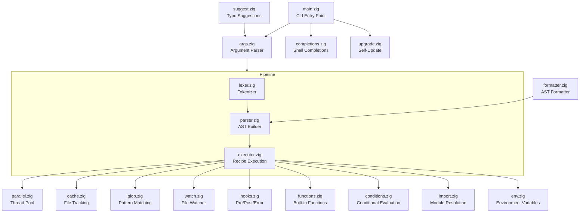

# AGENTS.md

This file provides guidance to Verdent when working with code in this repository.

## Table of Contents

1. [Commonly Used Commands](#commonly-used-commands)
2. [High-Level Architecture & Structure](#high-level-architecture--structure)
3. [Key Rules & Constraints](#key-rules--constraints)
4. [Development Hints](#development-hints)

---

## Commonly Used Commands

### Build & Install

```bash
zig build                            # Debug build
zig build -Doptimize=ReleaseFast     # Optimized build
zig build -Dtracy=true               # Build with Tracy profiler support
jake install                         # Install to ~/.local/bin
```

### Testing

```bash
zig build test                       # Unit tests (uses custom Run step to avoid --listen hang)
jake e2e                             # End-to-end tests (jake testing jake)
zig build fuzz --fuzz                # Coverage-guided fuzz tests
jake test-completions                # Test shell completions (bash/zsh/fish)
```

### Code Quality

```bash
zig fmt src/                         # Format source files
jake lint                            # Check code formatting
jake ci                              # Lint + test + build (CI checks)
```

### Development Workflow

```bash
jake dev                             # Development build
jake dev -w                          # Development build with watch mode
jake rebuild                         # Clean and rebuild
```

### Benchmarking & Profiling

```bash
jake bench                           # Benchmark vs just (requires hyperfine)
jake bench-startup                   # Benchmark startup time
jake bench-parse                     # Benchmark parsing different file sizes
jake profile                         # CPU profiling with samply
jake leaks                           # Memory leak check (macOS only)
```

### Single Test Execution

```bash
# Zig doesn't have built-in single test filtering
# Use --test-filter (experimental in Zig 0.15+):
zig build test --test-filter "test_name"
```

---

## High-Level Architecture & Structure

### Overview

**Jake** is a modern command runner/build system written in Zig that combines features from GNU Make and Just with clean syntax, parallel execution, and file-based dependency tracking.

**Repository:** https://github.com/HelgeSverre/jake  
**Language:** Zig 0.15.2+  
**Status:** Work in progress (not yet production-ready)

### Subsystems & Responsibilities



### Key Data Flow

#### 1. Execution Flow

```
User Input → CLI Args → Jakefile Location → Lexer → Parser → AST → Executor → Commands
                                                                         ↓
                                                                   Pre-hooks → Recipe Commands → Post-hooks
                                                                         ↓
                                                                   Cache Update (file targets)
```

#### 2. Recipe Dependency Resolution

- Dependencies resolved via topological sort
- Parallel execution using thread pool (`-j N`)
- File targets: rebuild only when sources newer than targets

#### 3. Variable Expansion

- Environment variables: `$VAR` or `${VAR}`
- Jakefile variables: `{{var}}`
- Built-in functions: `{{uppercase(text)}}`, `{{home()}}`, etc.

### External Dependencies

**Build-time:**

- Zig compiler 0.15.2+
- Git (for version detection in `build.zig`)

**Runtime:**

- None (statically linked executable)

**Optional:**

- Tracy profiler (lazy dependency, enabled with `-Dtracy=true`)
- zbench (benchmarking library, build dependency)

**Development tools:**

- hyperfine (benchmarking)
- samply (profiling)
- Docker (completions testing)

### Development Entry Points

**Main module:** `src/main.zig:35` - `pub fn main() !void`  
**Library API:** `src/root.zig` - Exports public functions:

- `parse(allocator, source)` - Parse Jakefile source string
- `load(allocator, path)` - Load and parse Jakefile from disk

**Key structures:**

- `Jakefile` (parser.zig) - AST containing variables, recipes, directives, imports
- `Recipe` - Task/file/simple recipe with dependencies, parameters, commands
- `Context` (context.zig) - Shared execution context (CLI flags, runtime config)

---

## Key Rules & Constraints

### From CLAUDE.md

#### Documentation Requirements

When adding or modifying user-facing behavior, update ALL relevant documentation:

1. `docs/SYNTAX.md` - Syntax reference
2. `docs/TUTORIAL.md` - Usage examples and patterns
3. `site/src/content/docs/` - Website documentation:
   - `docs/conditionals.md` - Condition functions
   - `docs/watch-mode.md` - Watch mode
   - `reference/directives.md` - Directives
   - `reference/functions.md` - Built-in functions
4. `TODO.md` - Mark completed features and update test counts

#### Versioning & Releases

- Version is **automatically derived from git tags** at build time
- No manual version bumping required
- Uses `git describe --tags` in `build.zig`
- Tag format: `vX.Y.Z` (leading `v` stripped for display)
- Release process:
  1. Update `CHANGELOG.md`
  2. Commit: `git commit -m "docs: update changelog for vX.Y.Z"`
  3. Tag: `git tag -a vX.Y.Z -m "vX.Y.Z release notes"`
  4. Push: `git push origin main && git push origin vX.Y.Z`
- GitHub Actions automatically builds binaries for all platforms

#### Commit Convention

```
feat: add new feature
fix: bug fix
docs: documentation
test: tests
refactor: code refactoring
perf: performance
```

### From README.md

- **Status:** Work in progress, not yet production-ready
- **License:** MIT
- **Minimum Zig version:** 0.15.2+

### Code Patterns & Conventions

#### Memory Management

- Use `std.mem.Allocator` for all allocations
- Structures implement `deinit()` for cleanup
- Track allocations and ensure proper cleanup

#### Error Handling

- Explicit error unions (`!Type`)
- Dedicated error sets per module
- No panics in production code

#### Testing

- Embedded tests in source files: `test "description" { ... }`
- E2E tests in `tests/e2e/` using fixture files
- Fuzz tests via `--fuzz` flag
- [inferred] Avoid `--listen` flag in test execution (causes IPC hang - see build.zig:183)

#### Compatibility

- `src/compat.zig` provides cross-version std library compatibility
- Support Zig 0.14 and 0.15+

#### Tracy Profiler Integration

- Optional, zero-cost when disabled
- Lazy dependency loaded only when `-Dtracy=true`
- Import via `src/tracy.zig`

---

## Development Hints

### Adding a New Built-in Function

1. **Add function to `src/functions.zig`:**

   ```zig
   pub fn myFunction(allocator: std.mem.Allocator, arg: []const u8) ![]const u8 {
       // Implementation
   }
   ```

2. **Register in function map (in `functions.zig`):**

   ```zig
   const FunctionMap = std.StringHashMap(*const fn (std.mem.Allocator, []const u8) anyerror![]const u8);
   // Add to map initialization
   ```

3. **Update documentation:**
   - `docs/SYNTAX.md` - Function syntax
   - `site/src/content/docs/reference/functions.md` - Function reference
   - `GUIDE.md` - Add example

4. **Add tests in `src/functions.zig`:**
   ```zig
   test "myFunction" {
       const result = try myFunction(std.testing.allocator, "input");
       defer std.testing.allocator.free(result);
       try std.testing.expectEqualStrings("expected", result);
   }
   ```

### Adding a New Directive

1. **Add directive type to `src/parser.zig`:**

   ```zig
   pub const DirectiveType = enum {
       // ... existing
       my_directive,
   };
   ```

2. **Update parser to recognize directive in `src/parser.zig`**

3. **Handle directive in `src/executor.zig`:**

   ```zig
   // In appropriate execution phase
   if (directive.type == .my_directive) {
       // Implementation
   }
   ```

4. **Update documentation:**
   - `docs/SYNTAX.md`
   - `site/src/content/docs/reference/directives.md`

5. **Add E2E tests in `tests/e2e/fixtures/directives/`**

### Modifying CLI Arguments

1. **Update `src/args.zig`:**
   - Add flag to `Flag` enum
   - Add field to `Args` struct
   - Update `flags` array with flag definition
   - Handle flag in parsing logic

2. **Update help text in `src/args.zig`**

3. **Use flag in `src/main.zig` or pass via Context**

4. **Add tests in `src/args.zig`**

5. **Update documentation:**
   - `README.md` - CLI reference
   - `GUIDE.md` - CLI reference section
   - `docs/CLI_DESIGN.md` - Design specification

### Adding E2E Tests

1. **Create fixture directory in `tests/e2e/fixtures/<category>/`**

2. **Add Jakefile with test scenario**

3. **Add test in `tests/e2e/Jakefile`:**

   ```jake
   task test-my-feature:
       cd fixtures/my-feature
       ../../zig-out/bin/jake <command>
       # Assert expected behavior
   ```

4. **Run: `jake e2e` or `cd tests/e2e && ../../zig-out/bin/jake test-all`**

### Modifying the Pipeline (Lexer/Parser/Executor)

- **Lexer changes:** Update token types in `src/lexer.zig`, add comprehensive tests
- **Parser changes:** Update AST structures in `src/parser.zig`, ensure formatter compatibility
- **Executor changes:** Consider impact on parallel execution, hooks, and caching
- [inferred] After parser changes, verify `src/formatter.zig` can round-trip the AST

### Working with Formatter

- **Entry point:** `src/formatter.zig`
- **Purpose:** AST → formatted Jakefile source
- **CLI:** `jake --fmt [--check] [--dump]`
- **Testing:** Round-trip tests verify `parse(format(parse(source))) == parse(source)`
- [inferred] Formatter must handle all AST node types to avoid data loss

### Performance Optimization

- **Profile with Tracy:** `zig build -Dtracy=true -Doptimize=ReleaseFast`
- **Benchmark internally:** `zig build bench` (uses zbench)
- **Benchmark vs competitors:** `jake bench` (uses hyperfine, compares with just)
- **CPU profiling:** `jake profile` (uses samply)
- **Memory leaks:** `jake leaks` (macOS only, uses leaks tool)

### Debugging Test Hangs

[inferred] If tests hang during `zig build test`:

- Check `build.zig:183-196` - custom Run steps avoid `--listen` flag
- IPC issue documented in https://github.com/ziglang/zig/issues/18111
- Use `std.Build.Step.Run.create()` instead of `addRunArtifact()` for test execution

### CI/CD Pipeline

**Workflows:**

- `.github/workflows/ci.yml` - Test on Linux/macOS/Windows, lint, E2E
- `.github/workflows/release.yml` - Cross-platform binary builds on tag push
- `.github/workflows/perf.yml` - Performance tracking
- `.github/workflows/stale.yml` - Stale issue management

**Matrix testing:** ubuntu-latest, macos-latest, windows-latest

**E2E in CI:** Builds release binary, runs `tests/e2e/Jakefile::test-all`

### Cross-Platform Considerations

- **File watching:** Platform-specific (FSEvents on macOS, inotify on Linux)
- **Path handling:** Use `std.fs.path` for cross-platform paths
- **Shell execution:** Default shell detection per platform
- **Color output:** Respect `NO_COLOR`, `CLICOLOR`, `CLICOLOR_FORCE` (see `src/color.zig`)

### Working with Modules (jake/\*.jake)

Jake's own build is modular:

- `jake/build.jake` - Core build, test, install tasks
- `jake/release.jake` - Cross-platform release builds
- `jake/perf.jake` - Performance and profiling tasks
- `jake/web.jake` - Website-related tasks
- `jake/editors.jake` - Editor integration setup

Import with: `@import "jake/module.jake" [as namespace]`

---

**Last updated:** 2025-12-31  
**Zig version:** 0.15.2+  
**Jake version:** Derived from git tags (see build.zig)

## Landing the Plane (Session Completion)

**When ending a work session**, you MUST complete ALL steps below. Work is NOT complete until `git push` succeeds.

**MANDATORY WORKFLOW:**

1. **File issues for remaining work** - Create issues for anything that needs follow-up
2. **Run quality gates** (if code changed) - Tests, linters, builds
3. **Update issue status** - Close finished work, update in-progress items
4. **PUSH TO REMOTE** - This is MANDATORY:
   ```bash
   git pull --rebase
   bd sync
   git push
   git status  # MUST show "up to date with origin"
   ```
5. **Clean up** - Clear stashes, prune remote branches
6. **Verify** - All changes committed AND pushed
7. **Hand off** - Provide context for next session

**CRITICAL RULES:**

- Work is NOT complete until `git push` succeeds
- NEVER stop before pushing - that leaves work stranded locally
- NEVER say "ready to push when you are" - YOU must push
- If push fails, resolve and retry until it succeeds
